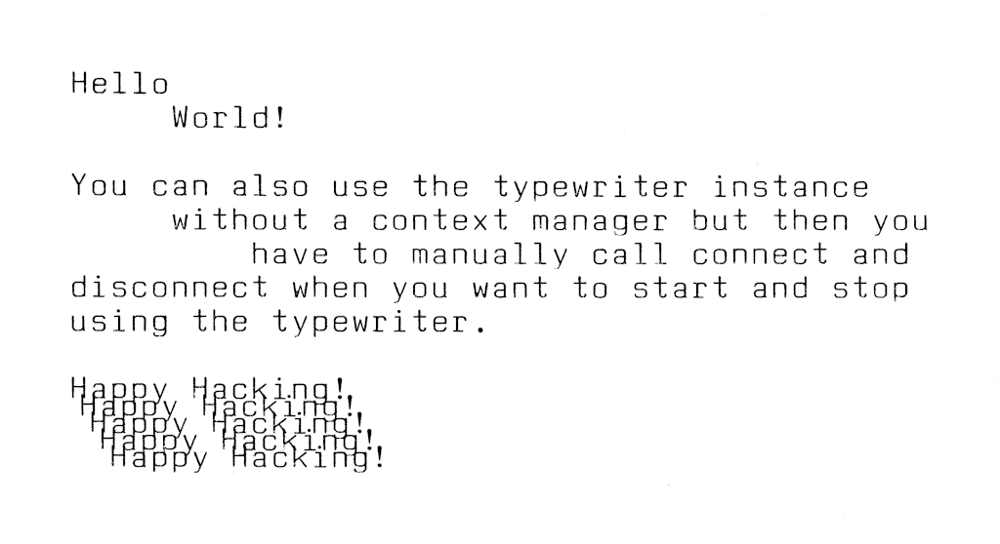
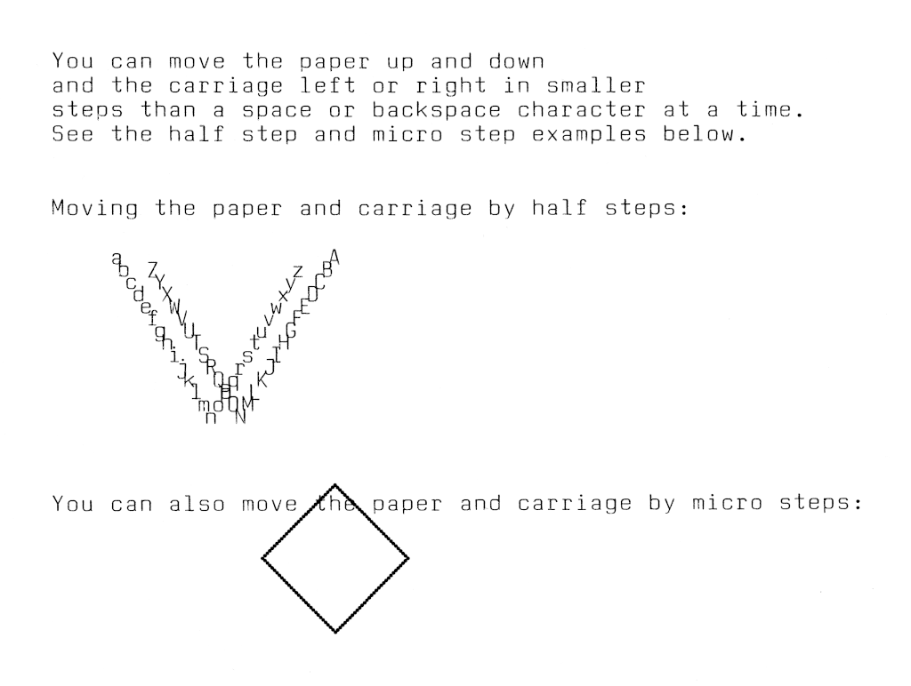
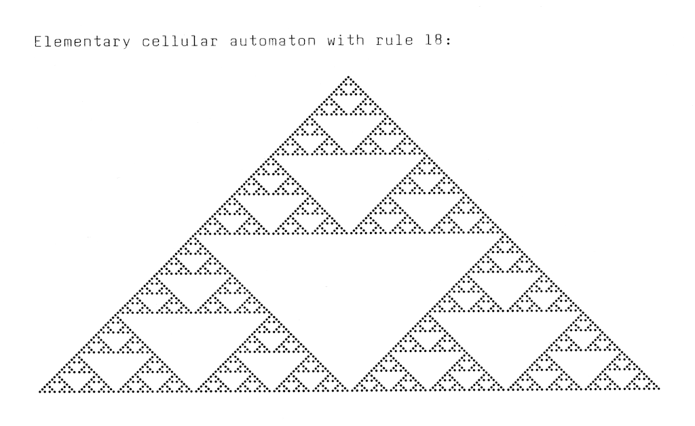

# erika-s3004

## Contents

* [About](#about)
* [License](#license)
* [Hardware setup](#hardware-setup)
  * [Erika connector](#erika-connector)
  * [USB to TTL adapter](#usb-to-ttl-adapter)
  * [Connecting the typewriter to USB to TTL adapter](#connecting-the-typewriter-to-usb-to-ttl-adapter)
* [Software](#software)
  * [Prerequisites](#prerequisites)
  * [TODOTitle](#todotitle)
  * [Character encoding](#character-encoding)
  * [Typewriter control](#typewriter-control)
* [Tests](#tests)
* [Examples](#examples)
  * [Simple example](#simple-example)
  * [Reading from the typewriter](#reading-from-the-typewriter)
  * [Paper and typewriter carriage movement](#paper-and-typewriter-carriage-movement)
  * [Elementary cellular automaton](#elementary-cellular-automaton)
  * [Drawing images](#drawing-images)
* [Resources](#resources)

## About

TODO

The project is structured in the following directories:

| Directory              | Description |
|------------------------|-------------|
| [`doc`](doc)           | TODO        |
| [`erika`](erika)       | TODO        |
| [`examples`](examples) | TODO        |
| [`test`](test)         | TODO        |

## License

This project is licensed under the MIT license. For the full license, please see [`LICENSE`](LICENSE).

## Hardware setup

TODO

### Erika connector

```
                                                                           +-------- RX
                                                                           |
                                                                           |  +----- RTS
                                                                           |  |
                                                                           |  |  +-- GND
                                                                           |  |  |
                                                                           v  v  v
   +--------------------------------------------------------------------------------+
   |                                                                                |
A1 |  O  O  O  O  O  O  O  O  O  O  O  O  O  O  O  O  O  O  O  O  O  O  O  O  O  O  | A13
   |                                                                                |
B1 |  O  O  O  O  O  O  O  O  O  O  O  O  O  O  O  O  O  O  O  O  O  O  O  O  O  O  | B13
   |                                                                                |
   +--------------------------------------------------------------------------------+
                                                                           ^  ^  ^
                                                                           |  |  |
                                                                           |  |  +-- TX
                                                                           |  |
                                                                           |  +----- +5V
                                                                           |
                                                                           +-------- DTD
```

| Connector | Function |
|-----------|----------|
| `A11`     | `RX`     |
| `A12`     | `RTS`    |
| `A13`     | `GND`    |
| `B11`     | `DTD`    |
| `B12`     | `+5V`    |
| `B13`     | `TX`     |

### USB to TTL adapter

TODO

### Connecting the typewriter to USB to TTL adapter

| USB to TTL adapter pin | Erika connector pin (function) |
|------------------------|--------------------------------|
| `TX`                   | `A11` (`RX`)                   |
| `CTS`                  | `A12` (`RTS`)                  |
| `GND`                  | `A13` (`GND`)                  |
| `RTS`                  | `B11` (`DTD`)                  |
| `+5V`                  | `B12` (`+5V`)                  |
| `RX`                   | `B13` (`TX`)                   |

## Software

### Prerequisites

TODO

drawing preview:

```sh
magick                       \
    /path/to/input/image.png \
    -geometry '256x>'        \
    -colorspace Gray         \
    -ordered-dither o2x2     \
    'pgm:preview.pgm'
```

### TODOTitle

### Character encoding

TODO: `hu-HU` language, etc.

| Character | Erika encoded character [byte] | Description                                       |
|-----------|--------------------------------|---------------------------------------------------|
| `\u0008`  | `0x72`                         | Backspace (U+0008)                                |
| `\u0009`  | `0x79`                         | Character tabulation (U+0009)                     |
| `\u000A`  | `0x77`                         | Line feed (lf) (U+000A)                           |
| `\u000D`  | `0x78`                         | Carriage return (cr) (U+000D)                     |
| `\u0020`  | `0x71`                         | Space (U+0020)                                    |
| `!`       | `0x3D`                         |                                                   |
| `"`       | `0x3F`                         |                                                   |
| `%`       | `0x33`                         |                                                   |
| `&`       | `0x0C`                         |                                                   |
| `'`       | `0x0F`                         |                                                   |
| `(`       | `0x3B`                         |                                                   |
| `)`       | `0x39`                         |                                                   |
| `+`       | `0x1B`                         |                                                   |
| `,`       | `0x63`                         |                                                   |
| `-`       | `0x62`                         |                                                   |
| `.`       | `0x64`                         |                                                   |
| `/`       | `0x35`                         |                                                   |
| `0`       | `0x65`                         |                                                   |
| `1`       | `0x2F`                         |                                                   |
| `2`       | `0x2D`                         |                                                   |
| `3`       | `0x2B`                         |                                                   |
| `4`       | `0x29`                         |                                                   |
| `5`       | `0x27`                         |                                                   |
| `6`       | `0x25`                         |                                                   |
| `7`       | `0x23`                         |                                                   |
| `8`       | `0x21`                         |                                                   |
| `9`       | `0x1F`                         |                                                   |
| `:`       | `0x02`                         |                                                   |
| `;`       | `0x0D`                         |                                                   |
| `=`       | `0x1A`                         |                                                   |
| `?`       | `0x37`                         |                                                   |
| `A`       | `0x2C`                         |                                                   |
| `B`       | `0x22`                         |                                                   |
| `C`       | `0x24`                         |                                                   |
| `D`       | `0x26`                         |                                                   |
| `E`       | `0x46`                         |                                                   |
| `F`       | `0x44`                         |                                                   |
| `G`       | `0x2A`                         |                                                   |
| `H`       | `0x28`                         |                                                   |
| `I`       | `0x41`                         |                                                   |
| `J`       | `0x20`                         |                                                   |
| `K`       | `0x42`                         |                                                   |
| `L`       | `0x1E`                         |                                                   |
| `M`       | `0x38`                         |                                                   |
| `N`       | `0x36`                         |                                                   |
| `O`       | `0x2E`                         |                                                   |
| `P`       | `0x45`                         |                                                   |
| `Q`       | `0x34`                         |                                                   |
| `R`       | `0x1C`                         |                                                   |
| `S`       | `0x43`                         |                                                   |
| `T`       | `0x32`                         |                                                   |
| `U`       | `0x30`                         |                                                   |
| `V`       | `0x3E`                         |                                                   |
| `W`       | `0x40`                         |                                                   |
| `X`       | `0x3A`                         |                                                   |
| `Y`       | `0x3C`                         |                                                   |
| `Z`       | `0x47`                         |                                                   |
| `_`       | `0x01`                         |                                                   |
| `a`       | `0x51`                         |                                                   |
| `b`       | `0x48`                         |                                                   |
| `c`       | `0x54`                         |                                                   |
| `d`       | `0x55`                         |                                                   |
| `e`       | `0x52`                         |                                                   |
| `f`       | `0x5E`                         |                                                   |
| `g`       | `0x4F`                         |                                                   |
| `h`       | `0x5B`                         |                                                   |
| `i`       | `0x56`                         |                                                   |
| `j`       | `0x5C`                         |                                                   |
| `k`       | `0x53`                         |                                                   |
| `l`       | `0x58`                         |                                                   |
| `m`       | `0x5D`                         |                                                   |
| `n`       | `0x4D`                         |                                                   |
| `o`       | `0x4C`                         |                                                   |
| `p`       | `0x59`                         |                                                   |
| `q`       | `0x57`                         |                                                   |
| `r`       | `0x50`                         |                                                   |
| `s`       | `0x5A`                         |                                                   |
| `t`       | `0x4E`                         |                                                   |
| `u`       | `0x4B`                         |                                                   |
| `v`       | `0x4A`                         |                                                   |
| `w`       | `0x5F`                         |                                                   |
| `x`       | `0x49`                         |                                                   |
| `y`       | `0x61`                         |                                                   |
| `z`       | `0x60`                         |                                                   |
| `\u00C1`  | `0x0E`                         | Latin capital letter a with acute (U+00C1)        |
| `\u00C9`  | `0x03`                         | Latin capital letter e with acute (U+00C9)        |
| `\u00CD`  | `0x11`                         | Latin capital letter i with acute (U+00CD)        |
| `\u00D3`  | `0x13`                         | Latin capital letter o with acute (U+00D3)        |
| `\u00D6`  | `0x0B`                         | Latin capital letter o with diaeresis (U+00D6)    |
| `\u0150`  | `0x15`                         | Latin capital letter o with double acute (U+0150) |
| `\u00DA`  | `0x06`                         | Latin capital letter u with acute (U+00DA)        |
| `\u00DC`  | `0x04`                         | Latin capital letter u with diaeresis (U+00DC)    |
| `\u0170`  | `0x08`                         | Latin capital letter u with double acute (U+0170) |
| `\u00E1`  | `0x16`                         | Latin small letter a with acute (U+00E1)          |
| `\u00E4`  | `0x0A`                         | Latin small letter a with diaeresis (U+00E4)      |
| `\u00E9`  | `0x17`                         | Latin small letter e with acute (U+00E9)          |
| `\u00ED`  | `0x19`                         | Latin small letter i with acute (U+00ED)          |
| `\u00F3`  | `0x05`                         | Latin small letter o with acute (U+00F3)          |
| `\u00F6`  | `0x09`                         | Latin small letter o with diaeresis (U+00F6)      |
| `\u0151`  | `0x07`                         | Latin small letter o with double acute (U+0151)   |
| `\u00FA`  | `0x18`                         | Latin small letter u with acute (U+00FA)          |
| `\u00FC`  | `0x12`                         | Latin small letter u with diaeresis (U+00FC)      |
| `\u0171`  | `0x14`                         | Latin small letter u with double acute (U+0171)   |

### Typewriter control

TODO


| code   | Function | Note |
|--------|------------------------------------------------|----------------------------------------|
| `0x71` | Space                                          | One character to the right (space bar) |
| `0x72` | Backspace                                      | One character to the left (backspace)  |
| `0x73` | half step right (half-space)                   | 1/2 character to the right             |
| `0x74` | half step left (half-backspace)                | 1/2 character to the left              |
| `0x75` | half step down                                 | 1/2 line down                          |
| `0x76` | half step up                                   | 1/2 line up                            |
| `0x77` | New line (carriage return + line feed)         | back to the beginning of the line and set line spacing down |
| `0x78` | Carriage return (CR, `\r`)                     | back to the beginning of the line      |
| `0x79` | Horizontal tab (`\t`)                          | right to the next tab                  |
| `0x7A` | Set tabulator                                  | T+ (set tab)                           |
| `0x7B` | Delete tab                                     | T- (Delete Tab)                        |
| `0x7C` | Delete all tabs                                | T- (delete all tabs)                   |
| `0x7D` | Set default tab stop                           | T+ (activate tab grid)                 |
| `0x7E` | Set margin left                                | Set margin left                        |
| `0x7F` | Set margin right                               | Set margin right                       |
| `0x80` | edge remover                                   | loosen the edge                        |
| `0x81` | 1/20 line break down                           | 1/20 line down (microstep)             |
| `0x82` | 1/20 line feed, high                           | 1/20 line above                        |
| `0x83` | paper feed                                     | paper feed                             |
| `0x84` | 1-line                                         | line spacing 1                         |
| `0x85` | 1.5 lines                                      | line spacing 1.5                       |
| `0x86` | 2-line                                         | line spacing 2"                        |
| `0x87` | 10 characters/inch                             |                                        |
| `0x88` | 12 characters/inch                             |                                        |
| `0x89` | 15 characters/inch                             |                                        |
| `0x8B` | Delete character OFF                           | Status: Printing (the following characters will be printed) |
| `0x8C` | Delete character ON                            | Status: Correct (the following characters are deleted with correction tape) |
| `0x8D` | reverse pressure OFF[^1]                       | Backward printing off; Forward printing (character printing, then feed) |
| `0x8E` | reverse pressure ON[^1]                        | Backward printing on; Backward printing (first feed backwards, then character printing) |
| `0x8F` | Edge release ON (external)[^1]                 | Open margin right; Extreme margin solver. The margin setting is no longer taken into account until SETRD arrives. |
| `0x90` | Set margin (external)[^1]                      | Close margin again; External margin setter (see LORED). This symbol is not approved for use! |
| `0x91` | Keyboard OFF (duplex)[^1]                      | Separation mode (separation of keyboard and printer); Duplex operation: All key information is only output to TxD and only that coming from RxD is printed (Corr, CREL and CRL are not effective!) |
| `0x92` | Keyboard ON (simplex)[^1]                      | Cancelling the separation mode; Simplex mode: All key information is printed |
| `0x95` | Reset, Synchron                                | Reinitialization of type wheel, repeat and line; reset, synchronization, printer basic settings |
| `0x96` | printer completion message                     | Printer completion message: RTS will only be activated again when the character is printed |
| `0x97` | second character set OFF                       | All keyboard codes are output according to the table. Unassigned keys of the code level are output with their matrix code 11xxxyyyB |
| `0x98` | second character set ON                        | Output of the keyboard codes with their matrix code. The keys are arranged in an 8 x 8 matrix. Bit format: zzmyyyB; zz = 01 = Normal, 10 = Shift, 11 = Code; mut = 000…111 = Column; yyy = 000…111 = Row |
| `0x99` |                                                | |
| `0x9A` |                                                | |
| `0x9B` | permanent function ON[^1]                      | Autorepeat on |
| `0x9C` | permanent function OFF[^1]                     | Autorepeat off |
| `0x9D` | 9CH and 9EH in normal circuit                  | Switch CSPE and CPILA functions to normal |
| `0x9E` | pilgrim step OFF                               | lock pilgrim step |
| `0x9F` | LF Line Feed (0AH; ^J)[^1]                     | one line down; line feed (1; 1.5; 2 = 40; 60; 80 motor steps) |
| `0xA0` | permanent function for all keys[^1]            | Instant repeat on |
| `0xA1` | Transfer rate 10-1200 bd, 08-2400 bd, 04-4800 bd, 02-9600 bd, 01-19200 | Change baud rate, the code for the new baud rate follows (10 = 1200, 08 = 2400, 04 = 4800, 02 = 9600, 01 = 19200). Not released! |
| `0xA3` | velocity (next character is strength)          | |
| `0xA4` |                                                | |
| `0xA5` | Tabulator (next character is step)             | Direct carriage control: The following byte specifies the number of steps. 0…127 steps forward; 256-(1..127) steps backward. Step size 1/120" |
| `0xA6` | carriage return (next character is step)       | Direct paper feed control: The following byte instructs the piercing roller to perform the corresponding number of steps (see A5); step size 1/240". Steps 3, 4, 5, 6 are forbidden! |
| `0xA7` | Turn the type wheel (next character is step)   | Direct type wheel control: The following byte instructs the type wheel to rotate the corresponding number of steps (see A5); step size 3.6° |
| `0xA8` | Ribbon transport (next character is step)      | Direct ribbon control: The following byte instructs the ribbon to advance 10° per step. |
| `0xA9` | no line feed (double print)                    | The character following this code is printed without advance (print on the spot) |
| `0xAA` | BEL Bell (Signal next character is signal length)(07H) | This code is followed by a byte with the length code for the signal generator (about 20 ms per unit) |
| `0xAB` | keyboard query                                 | |
| `0xAC` | Keyboard query 2 (with 00 bytes from keyboard) | |
| `0xAD` | corresponding to the green REL function[^2]    | Delete Relocate |
| `0xAE` | delete last character[^2]                      | correction function |
| `0xAF` | Relocated[^2]                                  | Relocate |

[^1]: These codes are only received, not sent.
[^2]: These characters are only sent, not received.

## Tests

TODO

## Examples

TODO

### Simple example

TODO

```sh
python3 examples/example_simple.py --device /dev/ttyUSB0
```



### Reading from the typewriter

TODO

```sh
python3 examples/example_read.py --device /dev/ttyUSB0
```

### Paper and typewriter carriage movement

TODO

```sh
python3 examples/example_movement.py --device /dev/ttyUSB0
```



### Elementary cellular automaton

TODO

```sh
python3 examples/example_automaton.py --device /dev/ttyUSB0
```



### Drawing images

TODO

[ImageMagick's built-in logo image](https://www.imagemagick.org/script/formats.php#builtin-images)

```sh
python3 examples/example_drawing.py --device /dev/ttyUSB0
```


## Resources

* [Chaostreff-Potsdam/erika3004](https://github.com/Chaostreff-Potsdam/erika3004)
* [Chaostreff-Potsdam/erika-docs](https://github.com/Chaostreff-Potsdam/erika-docs)
* [jbb/erika_S3004](https://codeberg.org/jbb/erika_S3004)
* [Erika S 3004 [Homecomputer DDR]](https://hc-ddr.hucki.net/wiki/doku.php/z9001/erweiterungen/s3004) ([archive.org](https://web.archive.org/web/20250215162723/https://hc-ddr.hucki.net/wiki/doku.php/z9001/erweiterungen/s3004))
* [practic 3/89, S. 135-137 [Homecomputer DDR]](https://hc-ddr.hucki.net/wiki/doku.php/z1013/literatur/practic-89-3-1) ([archive.org](https://web.archive.org/web/20250215162540/https://hc-ddr.hucki.net/wiki/doku.php/z1013/literatur/practic-89-3-1))
* [Informationen zur Modellreihe Erika electronic 30xx](https://erika-electronic.de/) ([archive.org](https://web.archive.org/web/20250211180518/https://erika-electronic.de/))

TODO
